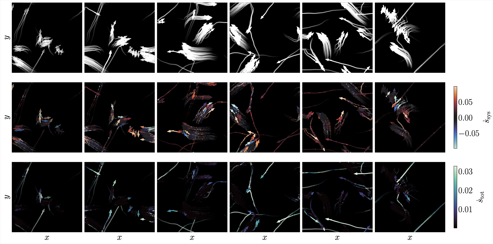

# vicsek_public



Public code repository for the paper ``Model-free learning of probability flows: Elucidating the nonequilibrium dynamics of flocking" (https://arxiv.org/abs/2411.14317).

This repository contains an implementation of the learning algorithm, code for dataset generation, and an API for generating data from common active matter systems such as active OU and Vicsek particles.

Model checkpoints are available upon request.

# Usage
The repository is split into several sub-directories that each make be useful. ``py`` contains all code needed for running experiments. ``py/common`` contains utilities common to multiple files. In particular, ``py/common/systems.py`` contains an API for implementing and integrating active matter systems with GPU-accelerated code, and includes implementations of the Vicsek model studied here as well as the active Ornstein-Uhlenbeck system.

``py/launchers`` contains training loop code, visualization, and associated logging to [Weights and Biases](https://wandb.ai).

``py/dataset_gen`` contains utilities useful for generating datasets from a given particle system. ``gen_dataset.py`` generates a single long trajectory, while ``gen_dataset_multitraj.py`` generates multiple longer trajectories.

``notebooks`` contains the code used to generate figures that appear in the paper, and can be used to interactively study data produced by the code provided in this repository.

All code is run from the command line and accepts command line arguments via the ``argparse`` module. For example,

```python
python py/launchers/learn.py
```

will print a list of required parameters to run a simulation. Similarly,

```python
python py/dataset_gen/gen_dataset_multitraj.py
```

will print a list of required parameters to generate a dataset.


# References
The following bibtex gives the reference for the associated paper. If you found the paper interesting or the code useful in your own research, please consider citing it.

```bibtex
@article{boffi_model_free_2024,
	title = {Model-free learning of probability flows: Elucidating the nonequilibrium dynamics of flocking},
	url = {https://www.arxiv.org/abs/2505.18825},
	author = {Boffi, Nicholas M. and Vanden-Eijnden, Eric},
	month = nov,
	year = {2024},
	journal = {arXiv:2411.14317},
}
```
